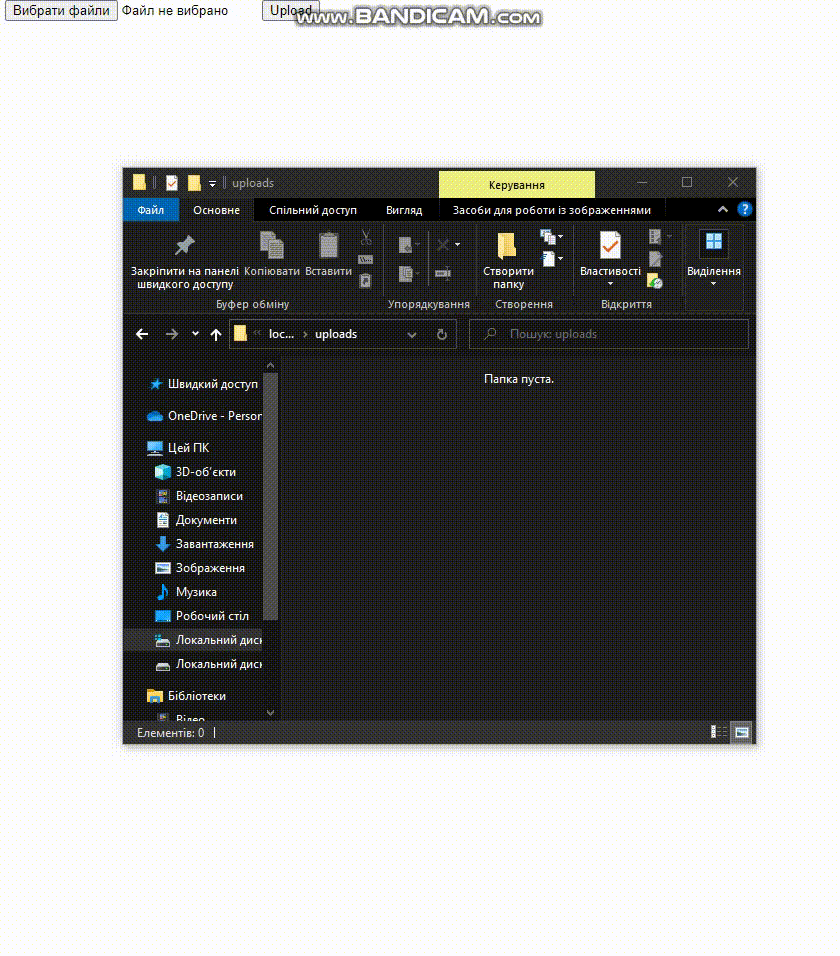
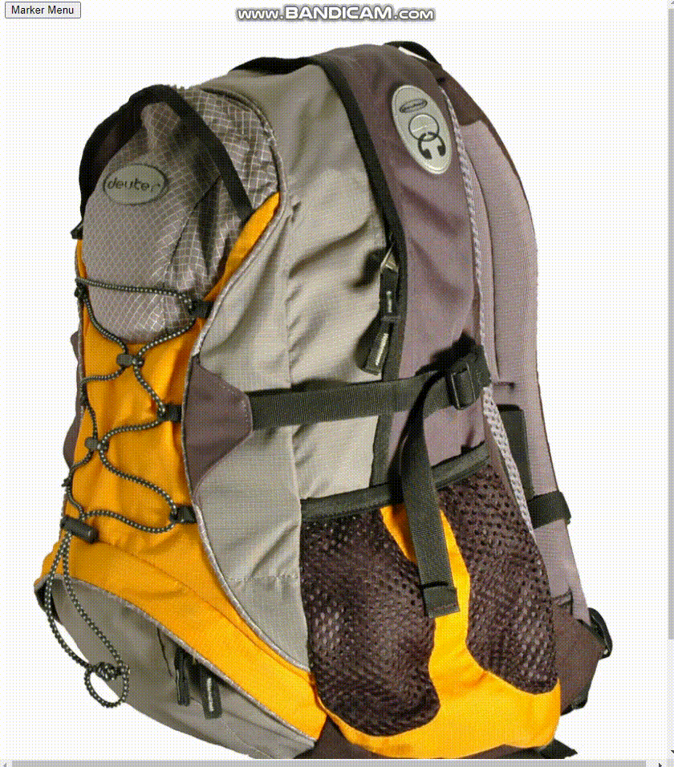

# Project "JsCloudIMG360View"
This project is an HTML-based application that allows users to upload and view a 360-degree image gallery. It utilizes several libraries and JavaScript functions to enable various features and functionalities.

## Libraries Used
- jQuery: The project includes the jQuery library (jquery-3.6.0.min.js) for simplified DOM manipulation and event handling.

- js-cloudimage-360-view: The project utilizes the js-cloudimage-360-view library (js-cloudimage-360-view.min.js) for creating and interacting with the 360-degree image viewer.

## Files and Components
The project consists of the following files and components:

- index.html: The main HTML file that serves as the entry point for the application. It includes the necessary HTML structure and references to CSS and JavaScript files.

- README.md: A Markdown file that provides information and instructions about the project.

- styles/: A folder containing CSS files used for styling the application.

- library/js-cloudimage-360-view/build/js-cloudimage-360-view.min.js: The minified JavaScript file for the js-cloudimage-360-view library.

- builder/dist/bundle.js: A JavaScript file that is responsible for building and initializing the 360-degree image viewer.

- script/: A folder containing JavaScript files that handle various functionalities of the application.

- upload.php: A PHP script that handles the file upload functionality on the server-side.

## Functionality and Features
The application provides the following functionality and features:

- File Upload: Users can upload multiple image files using the "IMPORT PHOTO" button and selecting the desired files.
  

- Initialization: Clicking the "Add360View" button initializes the 360-degree image viewer with the ID "gurkha-suv" and sets the server folder path and file name for the images to be displayed.
  

- Marker Menu: The "Marker Menu" button toggles the visibility of a marker menu that allows users to add markers to the image viewer.
  

- Marker Positioning: Users can specify the position of the marker using the "Position Y" and "Position X" input fields.
  

- Frame Selection: Users can select a specific frame using the "From" and "To" input fields.
  

- GoTo: Clicking on a marker icon triggers a function that scrolls the image viewer to the specified frame.
  

- Hotspots: The project includes functionality for adding hotspots to the 360-degree image viewer.
